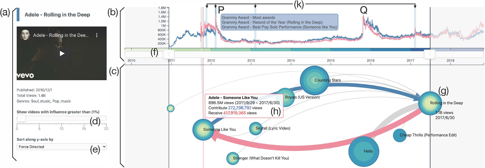

# AttentionFlow: Visualising Influence in Networks of Time Series



The collective attention on online items such as web pages, search terms, and
videos reflects trends that are of social, cultural, and economic interest.
Moreover, attention trends of different items exhibit mutual influence via
mechanisms such as hyperlinks or recommendations. Many visualisation tools
exist for time series, network evolution, or network influence; however, few
systems connect all three. In this work, we present AttentionFlow, a new system
to visualise networks of time series and the dynamic influence they have on one
another. Centred around an ego node, our system simultaneously presents the
time series on each node using two visual encodings: a tree ring for an
overview and a line chart for details. AttentionFlow supports interactions such
as overlaying time series of influence, and filtering neighbours by time or
flux. We demonstrate AttentionFlow using two real-world datasets, Vevo and
Wiki. We show that attention spikes in songs can be explained by external
events such as major awards, or changes in the network such as the release of a
new song. Separate case studies also demonstrate how an artist's influence
changes over their career, and that correlated Wikipedia traffic is driven by
cultural interests. More broadly, AttentionFlow can be generalised to visualise
networks of time series on physical infrastructures such as road networks, or
natural phenomena such as weather and geological measurements.

Please cite with the following BibTeX:

```raw
@inproceedings{Shin2021AttentionFlow,
  author    = {Shin, Minjeong and Tran, Alasdair and Wu, Siqi and Mathews, Alexander and Wang, Rong and Lyall, Georgiana and Xie, Lexing},
  title     = {AttentionFlow: Visualising Influence in Networks of Time Series},
  year      = {2021},
  publisher = {Association for Computing Machinery},
  doi       = {10.1145/3437963.3441703},
  booktitle = {Proceedings of the 14th International Conference on Web Search and Data Mining},
  series    = {WSDM '21}
}
```

## Service overview

| Service       | Production                      | Development                     | Local                       |
| ------------- | ------------------------------- | ------------------------------- | --------------------------- |
| Frontend App  | https://attentionflow.ml        | https://dev.attentionflow.ml    | http://localhost:3002       |
| Neo4j Browser | http://43.240.97.170:7474       | http://43.240.97.170:7475       | http://localhost:7475       |
| Django server | http://43.240.97.170:8001/admin | http://43.240.97.170:8002/admin | http://localhost:8002/admin |

## Getting Started

How to set up the local development on your Mac machine:

```sh
# Download brew
/usr/bin/ruby -e "$(curl -fsSL https://raw.githubusercontent.com/Homebrew/install/master/install)"

# Download yarn
brew install yarn

# Download Docker from https://docs.docker.com/docker-for-mac/install/

# Clone the repo
mkdir $HOME/projects && cd $HOME/projects
git clone git@github.com:alasdairtran/vevoviz.git

# Download the dependencies on the front-end
cd $HOME/projects/vevoviz/frontend && yarn

# Migrate the postgres database
cd $HOME/projects/vevoviz && docker-compose run backend python manage.py migrate --noinput

# Make you you have the apoc plugin (useful Cypher helper functions)
cd neo4j/plugins
sudo wget https://github.com/neo4j-contrib/neo4j-apoc-procedures/releases/download/4.1.0.2/apoc-4.1.0.2-all.jar

# Start the frontend app and Neo4j database
cd $HOME/projects/vevoviz
docker-compose up
```

The frontend app is available at [http://localhost:3002/](http://localhost:3002/) and Neo4j database is [http://localhost:7475/](http://localhost:7475/).
Note that the local Neo4j database needs restore the data dump from the remote server.

```sh
cd $HOME/projects/vevoviz

# Delete old database
rm -rf neo4j/data/*

# Shut down the local server
docker-compose down

# For any major upgrades, we also need to rebuild the docker images
docker-compose build --no-cache

# Download the backup
rsync -rlptzhe ssh --info=progress2 <username>@43.240.97.170:/mnt/vevoviz_prod/neo4j/data/backups neo4j/data/

## if you see this error: "rsync: --info=progress2: unknown option"
## make sure rsync is with the latest version (>=3.1.3)

# Restore
docker run \
--name neo4j-restore \
--mount type=bind,source=$HOME/projects/vevoviz/neo4j/data,target=/data \
neo4j:4.1.1 bin/neo4j-admin load --database=neo4j --from=/data/backups/neo4j.dump --force

# Delete the restore container
docker rm neo4j-restore

# Start the server again
docker-compose up
```

Before making a commit, make sure that you format the code properly:

```sh
# Format Python code
isort **/*.py && autoflake --remove-all-unused-imports --ignore-init-module-imports -i -r . && autopep8 -i **/*.py

# Format JavaScript code
cd $HOME/projects/vevoviz/frontend && yarn pretty
```

## Working Remotely

```sh
# Inside the Nectar virtual machine, start the production app
cd /mnt/vevoviz_prod && sudo docker-compose -f docker-compose.prod.yml up -d

# Start the development app
cd /mnt/vevoviz_dev && sudo docker-compose up -d
```

## Backing up the Neo4j database

```sh
cd /mnt/vevoviz_prod

# Shut down database
docker-compose stop neo4j

# Back up
docker run \
--name neo4j-dump \
--mount type=bind,source=/mnt/vevoviz_prod/neo4j/data,target=/data \
neo4j:4.1.1 bin/neo4j-admin dump --database=neo4j --to=/data/backups/neo4j.dump

# Restart database
docker-compose start neo4j

# Delete the backup container
docker rm neo4j-dump
```
